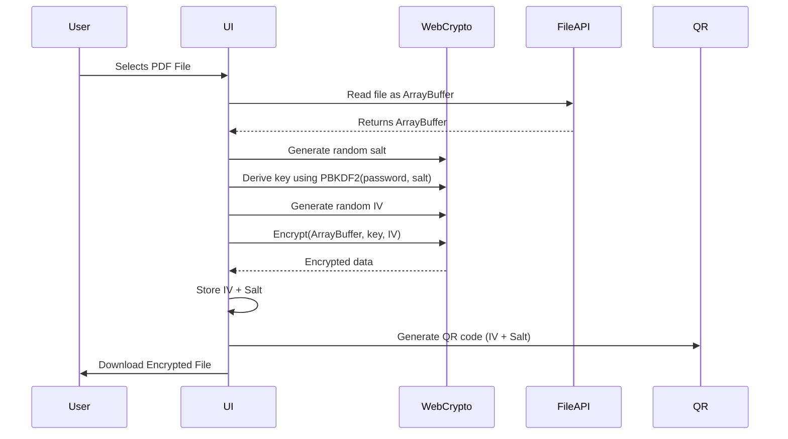
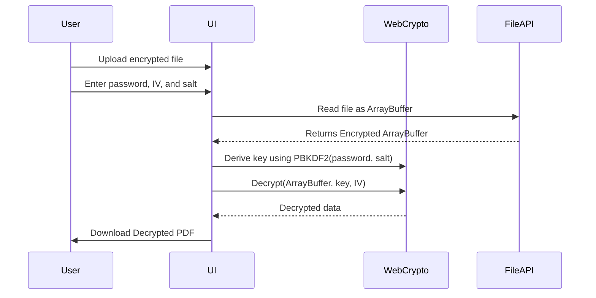

# 🔐 Browser Document Encryption Showcase

This showcase demonstrates how to securely encrypt and decrypt PDF files in the browser - without sending data to a server.

Try it out [here](https://browser-document-encryption-showcas.vercel.app)!

## 🚀 Features

- 📥 Upload PDF files via button (Drag'n'Drop compatible)
- 🔐 AES-GCM encryption using a user-defined password
- 🧂 Generates a secure **salt** for PBKDF2-based key derivation
- 🔁 Generates a unique **IV (initialization vector)** for each encryption
- 📤 Encrypted files are available for download
- 📥 Decrypt files locally using password + salt + IV
- 📱 **QR code export** of Salt & IV for cross-device usage

## 🧠 Understanding Salt & IV

### 🧂 What is a Salt?

A **salt** is a randomly generated string used when deriving a cryptographic key from a password (e.g. with PBKDF2).

**Why is it important?**

- Protects against rainbow table attacks
- Ensures that users with the same password get different keys
- Must be **unique per encryption** and stored/transferred along with the encrypted file

### 🔁 What is an IV?

The **initialization vector (IV)** is a random value used alongside the encryption key.

**Why is it needed?**

- Prevents the same plaintext and key from producing the same ciphertext
- Ensures **non-repetitive, secure encryption**
- Does **not need to be secret**, but must be **unique per encryption process**

## 📱 QR Code for Salt & IV

After encryption, the app generates a QR code containing the Base64-encoded Salt and IV.

⚠️ **Note:** The password is **not included** in the QR code. Only use it to transfer Salt & IV between devices.

---

## Encryption Process

### 🔐 Encryption Flow



### Decryption Flow



## 🛠️ Getting Started

```bash
npm install
npm run dev
